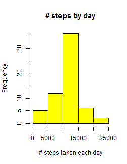

This project makes use of data from a personal activity monitoring device. The device collects data at 5 minute intervals through out the day. The data consists of two months of data from an anonymous individual collected during the months of October and November, 2012 and include the number of steps taken in 5 minute intervals each day. We use R Markdown to complete the project.

The dataset consists of 17,568 observations and three variables: *steps*, *date* and *interval*. Please see the accompanying "Readme.md" file for more about the dataset.

## Loading and preprocessing the data

1. The code that is needed to download the data is

```r
download.file("https://d396qusza40orc.cloudfront.net/repdata%2Fdata%2Factivity.zip","activity/activity.csv")
```

Read the data to R. Warning...if the data is still in your "activity.zip", you may need to unzip the data manually to a folder called "activity" in your working directory (or use another coding strategy to unzip) before reading to R!


```r
data<-read.csv("activity/activity.csv")
```

2. We remove `NA`s for convenience, and call the processed/transformed data "datap".


```r
datap<-subset(data,data$steps!="NA")
```


## What is mean total number of steps taken per day?

For this part of the assignment, we ignored the observations (rows) with missing values (those values recoded as `NA` in the dataset).

1. A histogram of the total number of steps taken each day is


```r
total_dsteps<-tapply(datap$steps,datap$date,sum)
hist(total_dsteps,main="# steps by day", xlab = "Total # of steps taken each day",col = "purple")
```

 

2. The mean and median total number of steps taken per day are (respectivelly)


```r
mean_dsteps<-mean(total_dsteps,na.rm=TRUE)
mean_dsteps
```

```
## [1] 10766
```

```r
median_dsteps<-median(total_dsteps,na.rm=TRUE)
median_dsteps
```

```
## [1] 10765
```

## What is the average daily activity pattern?

1. A time series plot of the 5-minute interval (x-axis) and the average number of steps taken, averaged across all days (y-axis) is


```r
options(warn=-1)
dataagg<-aggregate(datap, by=list(date=datap$date,interval=datap$interval),FUN=mean,na.rm=TRUE)
plot(dataagg$interval,dataagg$steps, type = "l", xlab="Interval", ylab="average number of steps", main = "Time series plot", col = "red")
```

 

2. The 5-minute interval which, on average across all the days in the dataset, contains the maximum number of steps, is:


```r
subdataagg<-subset(dataagg, dataagg$steps==max(dataagg$steps))
subdataagg$interval[1]
```

```
## [1] 615
```


## Imputing missing values

1. The total number of missing values in the dataset (i.e. the total number of rows with 'NA' s) is


```r
totalmissing_subset<-subset(data,is.na(data$steps)=="TRUE"|is.na(data$date)=="TRUE"|is.na(data$interval)=="TRUE")
nrow(totalmissing_subset)
```

```
## [1] 2304
```

Notice that the total number of missing values in the dataset may also be read off from the summary of the working data, as shown below.


```r
summary(data)
```

```
##      steps               date          interval   
##  Min.   :  0.0   2012-10-01:  288   Min.   :   0  
##  1st Qu.:  0.0   2012-10-02:  288   1st Qu.: 589  
##  Median :  0.0   2012-10-03:  288   Median :1178  
##  Mean   : 37.4   2012-10-04:  288   Mean   :1178  
##  3rd Qu.: 12.0   2012-10-05:  288   3rd Qu.:1766  
##  Max.   :806.0   2012-10-06:  288   Max.   :2355  
##  NA's   :2304    (Other)   :15840
```

2. One "not so sophesticated" strategy to compensate for the missing steps is to use the mean steps for that five minute interval. We will employ this strategy below by creating a new column of "meansteps" and use this column to replace `NA` s in the steps column. 

3. A new dataset that is equal to the original dataset but with the 
missing steps filled in with meansteps of the 5 minute intervals may be created as follows.

 

```r
datanew<-data

## create a dataset aggregated by the 5 minute intervals
datanewagg<-aggregate(data, by=list(interval=datanew$interval),FUN=mean,na.rm=TRUE)

## Choose a cleaner data, with only the columns we want and give 
## appropriate (non confusing) names to the variables
datanewagg<-datanewagg[,1:2]
names(datanewagg)<-c("interval", "meansteps")

## merge the aggregated data to the old data (with id="interval") to have 
## new columns of means by intervals for the old dataset
datamerged<-merge(data,datanewagg,by="interval")

## impute missing values of steps from the column of meansteps
datamerged$steps[is.na(datamerged$steps)] <- datamerged$meansteps[is.na(datamerged$steps)]

## call the resulting imputed dataset "datanew"; make sure the new 
## dataset is ordered as the original
datanew<-datamerged
datanew<-datanew[order(datanew$date,datanew$interval),]

## the code in the next line will show the head of this new dataset followed 
## by an output from the belly of this new dataset
head(datanew)
```

```
##     interval   steps       date meansteps
## 1          0 1.71698 2012-10-01   1.71698
## 63         5 0.33962 2012-10-01   0.33962
## 128       10 0.13208 2012-10-01   0.13208
## 205       15 0.15094 2012-10-01   0.15094
## 264       20 0.07547 2012-10-01   0.07547
## 327       25 2.09434 2012-10-01   2.09434
```

```r
datanew[13000:13007,]
```

```
##      interval steps       date meansteps
## 2390      315     0 2012-11-15   0.00000
## 2472      320     0 2012-11-15   0.20755
## 2526      325    33 2012-11-15   0.62264
## 2620      330     8 2012-11-15   1.62264
## 2680      335     0 2012-11-15   0.58491
## 2733      340     0 2012-11-15   0.49057
## 2796      345     0 2012-11-15   0.07547
## 2857      350     0 2012-11-15   0.00000
```

4 Following is a histogram of the total number of steps taken each day. We also report separately the mean and median total number of steps taken per day.


```r
total_dsteps_new<-tapply(datanew$steps,datanew$date,sum)
hist(total_dsteps_new,xlab = "# steps taken each day",col="yellow",main="# steps by day")
```

 

```r
mean_dsteps_new<-mean(total_dsteps_new,na.rm=TRUE)
mean_dsteps_new
```

```
## [1] 10766
```

```r
median_dsteps_new<-median(total_dsteps_new,na.rm=TRUE)
median_dsteps_new
```

```
## [1] 10766
```

The values of mean and median of the new (imputed) data do not differ from the estimates from the old data (first part). The impact of imputing missing data with estimates from meansteps of the five minute intervals seems mainly a matter of convenience for statistical works and analysis.Indeed, the mean or median are the best point estimates, even for missing values. 

## Are there differences in activity patterns between weekdays and weekends?

Here, we use the dataset with the filled-in missing values.

1. We create a new factor variable in the dataset with two levels -- "weekday" and "weekend" indicating whether a given date is a weekday or weekend day.


```r
## create new column with the seven names of weekdays and weekends.
datanew$daytype<-weekdays(as.Date(datanew$date))
## Collapse the seven day names to weekday or weekend
datanew$daytype[datanew$daytype=="Saturday"|datanew$daytype=="Sunday"]<-"weekend"
datanew$daytype[datanew$daytype!="weekend"]<-"weekday"
head(datanew)
```

```
##     interval   steps       date meansteps daytype
## 1          0 1.71698 2012-10-01   1.71698 weekday
## 63         5 0.33962 2012-10-01   0.33962 weekday
## 128       10 0.13208 2012-10-01   0.13208 weekday
## 205       15 0.15094 2012-10-01   0.15094 weekday
## 264       20 0.07547 2012-10-01   0.07547 weekday
## 327       25 2.09434 2012-10-01   2.09434 weekday
```

```r
## oh yeah, this is how it is done in just 3 lines, requiring no looping!
```

2. Following is a panel plot containing a time series plot of the 5-minute interval (x-axis) and the average number of steps taken, averaged across all weekday days or weekend days (y-axis). We use the lattice system of plotting.


```r
## Prepare aggregated data by mean for plotting
datanew_agg<-aggregate(datanew, by=list(date=datanew$date,interval=datanew$interval,daytype=datanew$daytype),FUN=mean,na.rm=TRUE)

## use latice syatem to plote
library(lattice)
xyplot(steps ~ interval | daytype, data = datanew_agg, type ="l", ylab="Number of steps", layout=c(1,2))
```

 


