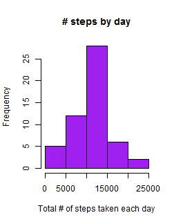

## Loading and preprocessing the data

1. The code that is needed to download the data is

```r
download.file("https://d396qusza40orc.cloudfront.net/repdata%2Fdata%2Factivity.zip","activity/fakename.csv")
```

Read the data to R. Warning...if the data is still in your "activity.zip", you need to unzip the data manually to a folder called "activity" in your working directory before reading to R!


```r
data<-read.csv("activity/activity.csv")
```

2. We removing NAs for convenience, and call the processed/transformed data "datap".


```r
datap<-subset(data,data$steps!="NA")
```


## What is mean total number of steps taken per day?
For this part of the assignment, we ignored the missing values in the dataset.

1. A histogram of the total number of steps taken each day is


```r
total_dsteps<-tapply(datap$steps,datap$date,sum)
hist(total_dsteps,xlab = "Total number of steps taken each day")
```

 

2. The mean and median total number of steps taken per day are 


```r
mean_dsteps<-mean(total_dsteps,na.rm=TRUE)
mean_dsteps
```

```
## [1] 10766
```

```r
median_dsteps<-median(total_dsteps,na.rm=TRUE)
median_dsteps
```

```
## [1] 10765
```


## What is the average daily activity pattern?

1. A time series plot (i.e. type = "l") of the 5-minute interval (x-axis) and the average number of steps taken, averaged across all days (y-axis) is


```r
options(warn=-1)
dataagg<-aggregate(datap, by=list(date=datap$date,interval=datap$interval),FUN=mean,na.rm=TRUE)
plot(dataagg$interval,dataagg$steps, type = "l",main = "Time series plot",col = "red")
```

 

2. The 5-minute interval which, on average across all the days in the dataset, contains the maximum number of steps, is:


```r
subdataagg<-subset(dataagg, dataagg$steps==max(dataagg$steps))
interval<-subdataagg$interval
interval
```

```
## [1] 615
```


## Imputing missing values

1. The total number of missing values in the dataset (i.e. the total number of rows with NAs) is

```r
totalmissing_subset<-subset(data,is.na(data$steps)=="TRUE"|is.na(data$date)=="TRUE"|is.na(data$interval)=="TRUE")
nrow(totalmissing_subset)
```

```
## [1] 2304
```

2. We use the mean for that day for filling in all of the missing values in the dataset. 

3. A new dataset that is equal to the original dataset but with the 
missing data filled in with the mean for that day is:
 

```r
datanew<-data
datanewagg<-aggregate(datanew, by=list(meandate=datanew$date),FUN=mean,na.rm=TRUE)
datanewagg<-datanewagg[,1:2]
names(datanewagg)<-c("date","meansteps")
datamerged<-merge(datanew,datanewagg,by="date")
datamerged$steps[is.na(datamerged$steps)] <- datamerged$mean[is.na(datamerged$steps)]
datanew<-datamerged
head(datanew)
```

```
##         date steps interval meansteps
## 1 2012-10-01   NaN        0       NaN
## 2 2012-10-01   NaN        5       NaN
## 3 2012-10-01   NaN       10       NaN
## 4 2012-10-01   NaN       15       NaN
## 5 2012-10-01   NaN       20       NaN
## 6 2012-10-01   NaN       25       NaN
```

4 Following is a histogram of the total number of steps taken each day and the the mean and median total number of steps taken per day.


```r
total_dsteps_new<-tapply(datanew$steps,datanew$date,sum)
hist(total_dsteps_new,xlab = "Total number of steps taken each day")
```

 

```r
mean_dsteps_new<-mean(total_dsteps_new,na.rm=TRUE)
mean_dsteps_new
```

```
## [1] 10766
```

```r
median_dsteps_new<-median(total_dsteps_new,na.rm=TRUE)
median_dsteps_new
```

```
## [1] 10765
```

The values of mean and median for the imputed data show that they do not differ from the estimates from the first part. The impact of imputing missing data on the estimates of the total daily number of steps seems mainly convenience for statistical works and analysis.

## Are there differences in activity patterns between weekdays and weekends?

Here, we use the dataset with the filled-in missing values.

1. We create a new factor variable in the dataset with two levels -- "weekday" and "weekend" indicating whether a given date is a weekday or weekend day.


```r
## create new column with the seven weekdays.
datanew$daytype<-weekdays(as.Date(datanew$date))
## Change the days to weekday or weekend
datanew$daytype[datanew$daytype=="Saturday"|datanew$daytype=="Sunday"]<-"weekend"
datanew$daytype[datanew$daytype!="weekend"]<-"weekday"
head(datanew)
```

```
##         date steps interval meansteps daytype
## 1 2012-10-01   NaN        0       NaN weekday
## 2 2012-10-01   NaN        5       NaN weekday
## 3 2012-10-01   NaN       10       NaN weekday
## 4 2012-10-01   NaN       15       NaN weekday
## 5 2012-10-01   NaN       20       NaN weekday
## 6 2012-10-01   NaN       25       NaN weekday
```

2. Make a panel plot containing a time series plot (i.e. type = "l") of the 5-minute interval (x-axis) and the average number of steps taken, averaged across all weekday days or weekend days (y-axis).


```r
## Prepare aggregated data by mean for plotting
datanew_agg<-aggregate(datanew, by=list(date=datanew$date,interval=datanew$interval,daytype=datanew$daytype),FUN=mean,na.rm=TRUE)

## use latice syatem to plote
library(lattice)
xyplot(steps ~ interval | daytype, data = datanew_agg, type ="l", ylab="Number of steps", layout=c(1,2))
```

 


